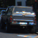
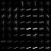
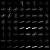
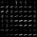
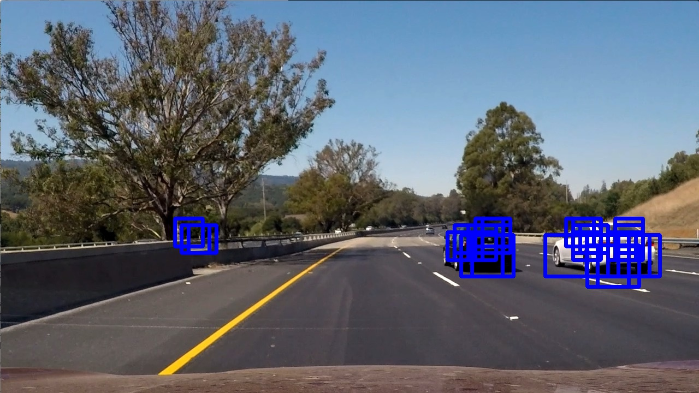
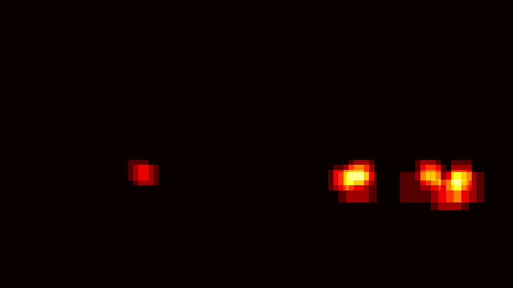
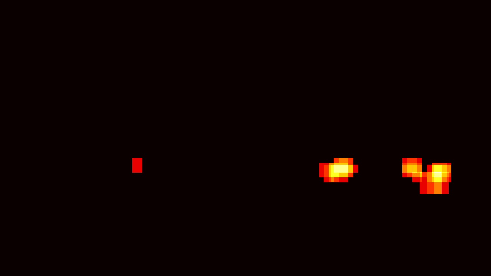
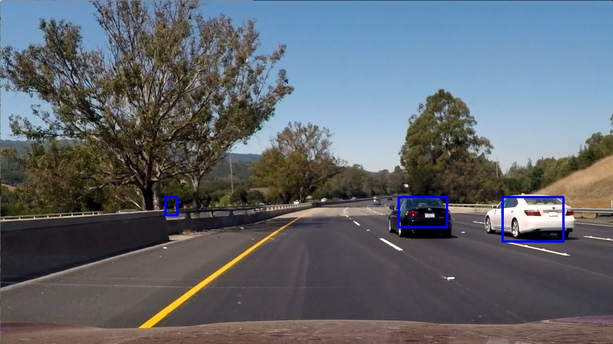
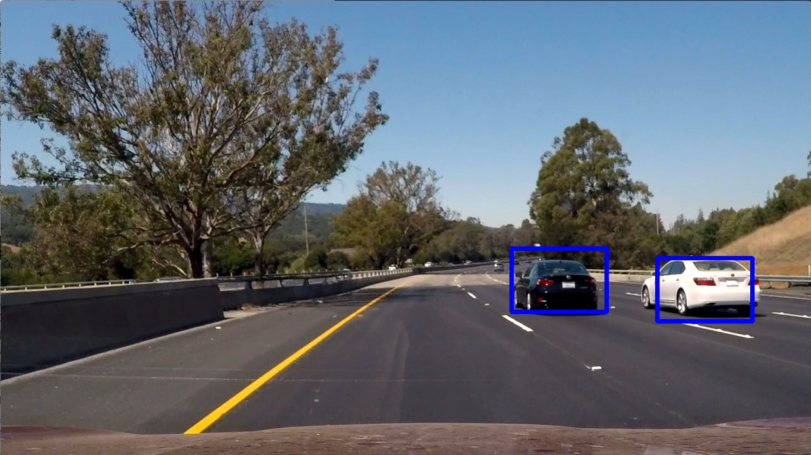

# Vehicle Detection and Tracking
> Please refer to: Self-Driving Car Engineer Nanodegree - Udacity, [Term 1 - Project 5](https://github.com/udacity/CarND-Vehicle-Detection)

### Overview
Using Histogram of Oriented Gradients (HOG) and a Support Vector Machine classifier, this project aims to draw a bounding box for vehicles detected in a video. 

The code is stored in a [Jupyter Notebook](http://jupyter.org/) and requires **Python 3.5**. Please refer to the [project website](https://github.com/udacity/CarND-Vehicle-Detection) for implementation details. 

This [video](https://vimeo.com/207707140) contains the outcome of this project - together with the results of the _Advanced-Lane-Finding_ project). 

## The Vehicle Detection and Tracking Project

The goals/steps of this project are the following:

* Perform a Histogram of Oriented Gradients (HOG) feature extraction on a labeled training set of images and train a Linear SVM classifier
* Optionally, apply a color transform and append binned color features, as well as histograms of color, to the HOG feature vector. 
* During those first two steps normalize your features and randomize a selection for training and testing.
* Implement a sliding-window technique and use your trained classifier to search for vehicles in images.
* Run your pipeline on a video stream (start with the test_video.mp4 and later implement on full project_video.mp4) and create a heat map of recurring detections frame by frame to reject outliers and follow detected vehicles.
* Estimate a bounding box for vehicles detected.

--- 

Here I will consider the [rubric points](https://review.udacity.com/#!/rubrics/513/view) individually and describe how I addressed each point in my implementation. 

---

### Histogram of Oriented Gradients (HOG)
>#1. _Explain how (and identify where in your code) you extracted HOG features from the training images. Explain how you settled on your final choice of HOG parameters._  

The code for this step is contained in the code at [cell 3-4-5-6] of my IPython notebook.   
I started by reading in all the `vehicle` and `non-vehicle` images filenames [cell 2]. The dataset contains 8792 vehicle and 8968 non-vehicle images. Images frequency is well balanced between the two classes, so I do not need to change the given proportions. At this stage, no images are read yet and I assume that the images are duly assigned in the given folders.    
To extract the Histogram of Oriented Gradients - HOG, I mainly used the functions explained in the lessons (see: _Vehicle Detection and Tracking, track 32: "Search and Classify"_) [cell 3]. However, I need to set some parameters [cell 4]. I explored different color spaces and different `skimage.hog()` parameters (`orientations`, `pixels_per_cell`, and `cells_per_block`) in reading and processing [cell 6] the given images. 

The final choice of features to select and use for SVM classifier was subject to some following constraints: (a) trying to avoid overfitting, (b) allow the program fit a limited memory space, (c) optimizing accuracy.  

The available set of functions in [cell 3] allows extracting other than HOG features, mainly related to the "raw" colors (of the image taken into consideration). In this respect, I decided to skip the color histogram and to use the three channels color features. 

Struggling with my 4GB Mac, I decided to slowly increase the number of features, looking at both performance indicators of my SVM and memory pressure. I compared different color space for different features size: results are shown in the following Table 1. The `reduce_features()` function [cell 5] allows to randomly select features, and I stopped jest once reached half (3030) of the total number of features: this kind of dropout could limit overfitting (a), but actually is mainly due to meet the memory constraint (b). Code for running extraction of features is in [cell 6].

_Table 1: Precision and recall for the validation dataset, for different color spaces and sample size (for training and validation) with the best C parameter.  
Min-max values of the decision function are referred to misclassified images only.
(Car are coded as 1, Non-cars as 0)_

|   Hog   | Training | Validation | Features |    svc   | BestC | 0_Prec. | 0_Recall| 1_Prec. | 1_Recall| decision (interval)   |
|:-------:|:--------:|:--------:|:--------:|:--------:|:-----:|:-------:|:-------:|:-------:|:-------:|:----------:|
|  YCrCb  | 12000 | 3000  |    8     | LinearSVC|  0.50 |   0.60  |   0.66  |   0.62  |   0.57  | -0.53 , 1.93 |
|  YCrCb  | 12000 | 3000  |  16      | LinearSVC|  0.50 |   0.69  |   0.69  |   0.70  |   0.70  | -2.15 , 1.42 |
|  YCrCb  | 12000 | 3000  |  32      | LinearSVC|  0.10 |   0.76  |   0.70  |    0.71 |   0.77  | -6.55 , 1.43 |
|  YCrCb  | 12000 | 3000  |  64      | LinearSVC|  0.05 |   0.88  |   0.90  |    0.90 |   0.88  | -4.26 , 3.64 |
|  YCrCb  | 12000 | 3000  | 128      | LinearSVC|  0.50 |   0.92  |   0.92  |    0.92 |   0.92  | -3.71 , 4.92 |
|  YCrCb  | 12000 | 3000  | 256      | LinearSVC|  0.50 |   0.96  |   0.97  |    0.97 |   0.95  | -5.19 , 3.9  |
|  YCrCb  | 12000 | 3000  | 512      | LinearSVC|  0.05 |   0.98  |   0.97  |    0.97 |   0.98  | -8.23 , 11.51|
|**YCrCb**| 12000 | 3000  |**1024**  | LinearSVC|  0.05 |   0.98  |   0.98  |    0.98 |   0.98  | -17.33 , 8.21|
|**HSV**  | 12000 | 3000  |**1024**  | LinearSVC|  0.05 |   0.98  |   0.98  |    0.98 |   0.98  | -10.26 , 9.87|
|  HLS    | 12000 | 3000  |  1024    | LinearSVC|  0.05 |   0.97  |   0.98  |    0.98 |   0.97  | -9.3 , 11.38 |
|  YCrCb  | 12000 | 3000  |  2048    | LinearSVC|  0.05 |   0.98  |   0.99  |    0.99 |   0.98  | -9.8 , 6.15  |
|**YCrCb**| 13500 | 1500  |**2048**  | LinearSVC|  0.25 | **0.99**| **0.99**| **0.99**| **0.98**| -11.63 , 6.78|
|**HSV**  | 13500 | 1500  |**2048**  | LinearSVC|  0.10 | **0.98**| **0.98**| **0.98**| **0.98**| -6.73 , 6.46 |
|  YCrCb  | 13500 | 1500  |  2400    | LinearSVC|  0.05 |   0.99  |   0.99  |    0.99 |   0.99  | -6.50 , 5.36 |
|  YCrCb  | 13500 | 1500  |  2800    | LinearSVC|  0.05 |   0.99  |   0.99  |    0.99 |   0.99  | -7.39 , 6.79 |
|  YCrCb  | 12000 | 3000  |  3030    | LinearSVC|  0.05 |   0.99  |   0.99  |    0.99 |   0.99  | -5.45 , 5.45 |

At the end, I preferred the YCrCb color space, using three channels. 

Here is an example using the `YCrCb` color space and HOG parameters of `orientations=9`, `pixels_per_cell=(8, 8)` and `cells_per_block=(2, 2)`, applied to a `vehicle` class image [cell 7].

**Original image (car)**
  
**Hog image (channel 0)**
    
**Hog image (channel 1)**
  
**Hog image (channel 2)**
  

>#2. _Describe how (and identify where in your code) you trained a classifier using your selected HOG features (and color features if you used them)._

Once set aside the sample for the test set, I scaled and divided data into train/test sets [cell 8]. Then, I trained a linear SVM classifier (trials also shown in [cell 9]).
I kept 2760 images for the test set: I did not use test data for scaling training/validation data. The accuracy for the test set was 0.9843 [cell 10].

Images in this dataset are often - but not always - from time-series (i.e. from a video) and therefore they are very similar. In this situation, you can face an issue when splitting data in training/validation and test set: the validation and test sets are a quasi-duplicate of the training one, so even an accuracy of .98 should be suspicious.  

---
### Sliding Window Search

>#1. _Describe how (and identify where in your code) you implemented a sliding window search. How did you decide what scales to search and how much to overlap windows?_

To implement a sliding window search, I fully used the `find_cars()` function explained in the lessons [cell 13] as well as the other suggested functions for heat-mapping [cell 14].  
I defined 3 window sizes, starting and stopping at different levels of the image. The size of such windows scales a 64by64 pixel square, starting with a scale of .8 and increasing it until 1.5 [cell 16]. In general, I set the top limit of search at the actual-horizon level (at the middle of the vertical side of the picture). Then, the code slides from top to (near the) bottom and (fully) from left to right: while two smaller size windows runs twice, the bigger one slides only one. This poor number of runs is joined with an overlapping of 2 to increase precision. To set parameters, I applied the procedure to the 6 test images as well to sub.clips of the video.   

Sliding costs a lot and I tried to find the right balance between the running time and the performance.   

In order to help to tune the sliding windows in this project, I coded three functions [cell 15]: 
`clear_undersized_rectancle()` excludes the small size rectangles, with an area less than 64x64 pixels.
`exist_rectangle()` checks for duplicated rectangles on the same place and does not allow overlapping
`size_rectangle()` standardizes the dimensions of the rectangles to a unique size.

>#2. _Show some examples of test images to demonstrate how your pipeline is working. How did you optimize the performance of your classifier?_

The pipeline applied to a single image follows the code in [cell 18-19-20].  After reading the image [cell 18], I applied HOG an SVM to find cars [cell 18] and used heatmaps to avoid outliers [cell 20]. 
Briefly, the pipeline includes the following steps (see also the picture below):
* Read the image
* Slide the windows while applying HOG extraction and the SVM model to detect frames with cars detection
* Heat-map the frames 
* Apply a heat-threshold (here set to 2 [cell 17])
* Identifies "core" rectangles that may target the car(s) avoiding overlapping via the `exist_rectangle()` detection function [cell 15]
* Purge small rectangles, under the hypothesis they are simply noise / outliers (`clear_undersized_rectancle()`, [cell 15])
* Resized the car-frame (`size_rectangle()` [cell 15]) in order to let the picture to be more readable.
The following pictures represent the above pipeline. 

**Test image**
  

**Initial car-frames detection**
  

**Heat map**
  

**Heat map** (_applying threshold_)
  

**Car position** (_from the heatmap_)
  

**Final centered fixed-frame car position**
  

---
### Video Implementation

>#1. _Provide a link to your final video output. Your pipeline should perform reasonably well on the entire project video (somewhat wobbly or unstable bounding boxes are ok as long as you are identifying the vehicles most of the time with minimal false positives.)_

Please, see the [video](https://vimeo.com/207707140) output.

>#2. _Describe how (and identify where in your code) you implemented some kind of filter for false positives and some method for combining overlapping bounding boxes._

In order to detect and avoid false positive, I created a stack variable `heat_memory` [cell 22] to store 6 previous heat-maps.  
The underlying idea is that real outliers should appear for no more than a couple of frames. So once run the heat-map (as described above) I add my stack previous heatmaps for obtaining a new multi-images heatmap for re-applying a greater heatmap-threshold (from 2 to 2+4). 

---
### Discussion

>_Briefly discuss any problems / issues you faced in your implementation of this project. Where will your pipeline likely fail? What could you do to make it more robust?._

Project 5 is a challenging project. Every step is reached in alternatives and a full list of them is quite impossible to write. I'll focus on the main issues I faced, and on the possible ways to improve the final result.  

Extracting HOG features is the core business of the project, and a brute force on all possible alternatives is not feasible. Training the video itself is another challenging aspect.  

Anyway, there are many good tools for classifying images and I think a batch-SVM approach could have help I was struggling with my memory pressure indicator.

In my code, there is still room for a great work in detecting cars and for stabilizing the exact dimension of the rectangles, for predicting positions, draw a cube that exactly fit cars, recognize black cars in the shadow, and a lot more.

Another field to explore is (LSTM) neural nets, instead of both applying SVM and stacking heatmaps.

